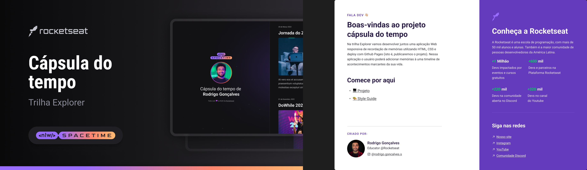

  

## 💻 Projeto 

Esse é um projeto web responsivo de uma cápsula do tempo

## 🚀 Tecnologias

- HTML
- CSS
- Git
- Github

## 🏷️ Layout

Você pode visualizar esse projeto através [desse link](https://www.figma.com/file/RLgjOJSEkUO675x1eIkudn/C%C3%A1psula-do-tempo-%E2%80%A2-Trilha-Explorer-(Community)?type=design&node-id=306-3&t=rNgXByR3wMtI5Zos-0)
É necessário ter uma conta no [Figma](https://www.figma.com/)